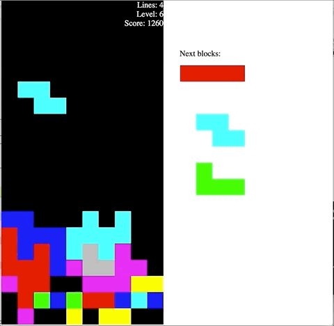

# Tetrominoes
A browser-based falling block game invented in Russia in the 1980s, in which the player attempts to make solid horizontal lines using tetronimoes  — block shapes consisting of four squares each.

You've probably played other games like it before:

## History
This is a piece of juvenilia; written somewhere around 2007 or possibly earlier as an excuse to poke around in JavaScript. Poorly.

Steven Wallace independently provided several valuable additions including the next-piece preview area circa 2008.
